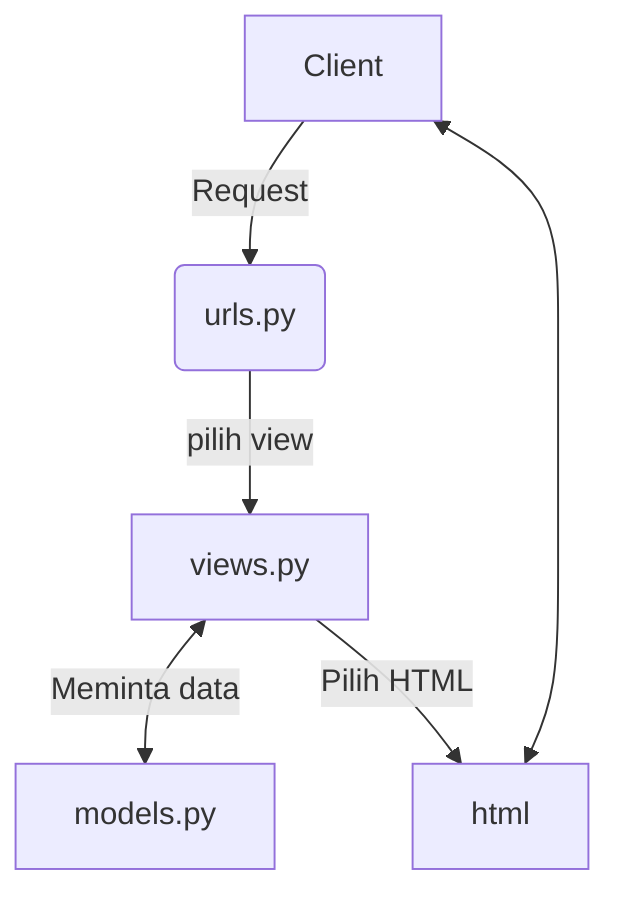

## Link Website
HEROKU : [link](https://lab02-pbp-abdul.herokuapp.com/)
## Tugas 2
1. 

Pada awalnya client akan melakukan request pada web. Request yang dilakukan akan terhubung langsung pada url yang dimintai request. Url tersebut akan memilih view yang digunakan pada url tersebut. View akan meminta data pada models jika diperlukan dan merender view tersebut dengan HTML. HTML yang telah dirender merupakan output diweb tersebut yang dapat dilihat.

2.Kita mengunakan virtual environment agar requirements yang diperlukan untuk project kita dapat berjalan. Kita bisa saja menjalankan tanpa virtual environment namun, ini adalah *bad practice* karena project kita biasanya tidak hanya berjalan disistem lokal kita saja. Maka ada baiknya untuk mengunakan virtual environment agar kita menginstall ulang semua requirements yang diperlukan.

3.Berikut penjelasan untuk setiap langkah :
* Langkah pertama saya mengimport model CatalogItem kemudian pengambil semua data yang berada pada CatalogItem. Kemudian kita merender berdasarkan katalog.html (html yang sudah dibuat untuk views ini) dan juga data yang diambil dari data CatalogItem.
* Langkah kedua saya menambahkan routing dari urls.py yang berada di project_django agar terhubung ke urls.py yang berada pada folder katalog. Kemudian saya menambahkan root yang ingin digunakan untuk merender views yang ada pada langkah pertama.
* Langkah ketiga, catak data katalog dari data yang sudah diberikan pada langkah pertama. Kita dapat melakukan ini dengan bantuan Django template language. Django template language memungkinkan kita untuk meiterasi data yang sudah diberikan dan mencetaknya dalam bentuk html.
* Langkah keempat, kita perlu membuat app baru pada heroku. Kemudian menambahkan secret key pada github repo yang sudah dibuat. Terakhir setelah kita lakukan push .github/workflows akan melakukan deployment di Heroku.